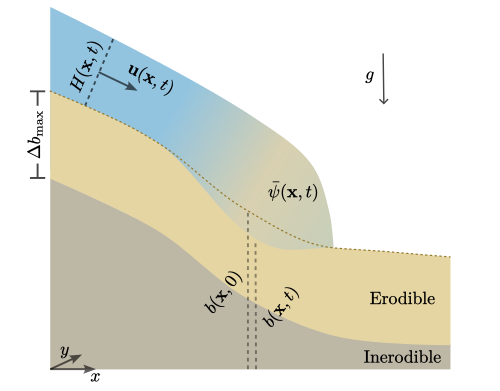

.. _physical_model:

Physical model
==============

Some understanding of the model equations that Kestrel uses is necessary to use
the program in an effective and informed manner. Here, we document the
components that are most important for using the software. If you want to know
more, the equations and the methods we use to solve them are detailed in this
`paper <https://arxiv.org/abs/2306.16185>`_.

.. _physical_model_assumptions:

Base assumptions
----------------

Kestrel is a code for simulating open flows of water and sediment - typically
environmental flows on the Earth's surface. Like all physical models, it uses a
simplified mathematical description of reality that tries to capture the most
essential processes in the system:

    - The flow is 'shallow', in the sense that its typical depth :math:`H` is
      much smaller than its lateral extent :math:`L`, i.e. :math:`H/L \ll 1`.
    - All sediment particles are small (relative to :math:`H`) and
      identical. Their slope-parallel velocity field is the same as the fluid's.
      Neither phase possesses any velocity shear.
    - A static erodible bed lies beneath the flow, which is homogeneously
      composed of saturated sediment occupying a constant volume fraction
      :math:`\psi_b`.
    - Any entrained sediment becomes instantaneously well-mixed within the water
      column perpendicular to the bed.
    - Beneath the erodible bed lies an inerodible bedrock. The initial thickness
      of the erodible layer, measured vertically, is a positive constant (which
      may be zero, for simulating flows on inerodible substrates).
    - The typical curvature of the bed is no greater (in an order-of-magnitude
      sense) than :math:`H/L` and the rate of change of bed elevation due to
      morphodynamics is no greater than the typical bed-normal velocity scale.

These assumptions lead to equations appropriate for modelling many, but not all
geophysical mass flows. In some cases, the model may be useful even for flows that
technically violate one or more of these assumptions, if the effect of relaxing
the relevant conditions is smaller than that of other processes that are
included.  Nevertheless, it's important to be mindful of these conditions when
assessing the applicability of Kestrel for modelling particular systems.

Further user-settable modelling choices are needed to complete the description,
which carry their own sets of assumptions. These will be discussed shortly.

.. _physical_model_equations:

Governing equations
-------------------

Using just the base assumptions, we can draw a schematic cross-section of the
system:

This shows a flow front atop the bed, which has vertical elevation :math:`b` and
features an erodible layer of thickness :math:`\Delta b_{\max}`. Its depth
:math:`H`, varies in space :math:`\mathbf{x} = (x,y)` and time :math:`t`. Note
that this is measured along the direction perpendicular to the bed slope. Though
the flow velocity :math:`\mathbf{u}` is assumed not to vary along this
direction, it is still a 3D vector. Due to the shallowness assumption, its
orientation is always aligned with the slope (to leading order). This means it
can be reconstructed from its (Cartesian) components in the horizontal plane.
These are the only velocity components that Kestrel directly solves for. We
denote them as :math:`\bar{u}` and :math:`\bar{v}`. Then

.. math::
   \mathbf{u} = \left(\bar{u}, \bar{v}, \frac{\partial b}{\partial x}\bar{u} + \frac{\partial b}{\partial y}\bar{v}\right)^T.

We must also keep track of the concentration of sediment. The base assumptions
imply that it may be treated as a continuous field that is mixed with the fluid.
We denote the fraction of volume occupied by solids at each point by
:math:`\bar{\psi}`.  The (depth-averaged) flow density :math:`\bar{\rho}`
depends on this quantity, as so

.. math::
   \bar{\rho}(\bar{\psi}) = \bar{\psi}\rho_s + (1 - \bar{\psi})\rho_f,

where :math:`\rho_s` and :math:`\rho_f` are the constant densities of sediment
and fluids respectively.

Towards the flow front on the diagram, the consequences of some erosion are
depicted - namely that the local solids concentration is enhanced and the bed
elevation is decreased, since that material has been added to the flow.

With the primary variables defined, we may now write down the governing
equations, that Kestrel solves. These are derived properly `elsewhere
<https://arxiv.org/abs/2306.16185>`_. To save space, we define the following
notation: :math:`\bar{\mathbf{u}} = (\bar{u}, \bar{v})^T`,
:math:`\nabla = (\partial / \partial x, \partial / \partial y)^T`, 
and 
:math:`\nabla_s = \nabla - \mathbf{s}(\mathbf{s}\cdot\nabla)`, with 
:math:`\mathbf{s} = \gamma^{-1}\nabla b` and

.. math::
   \gamma = \sqrt{1 + (\partial b/\partial x)^2 + (\partial b/\partial y)^2}.

Then, the full equation system is

.. math::

    \frac{\partial H}{\partial t} + \nabla\cdot(H\bar{\mathbf{u}}) &= \mathcal{E} - \mathcal{D} + \mathcal{Q}_H,\label{eq:governing eqs 1}\\
    \frac{\partial~}{\partial t}(H\bar{\psi}) + \nabla\cdot(H\bar{\mathbf{u}}\bar{\psi}) &= \psi_b (\mathcal{E} - \mathcal{D}) + \mathcal{Q}_H\mathcal{Q}_{\bar{\psi}},\\
    \frac{\partial ~}{\partial t}(\bar{\rho} H \bar{\mathbf{u}}) +  \nabla\cdot(\bar{\rho} H\bar{\mathbf{u}}\otimes \bar{\mathbf{u}}) + \gamma\nabla_s\left(\frac{\rho g H^2}{2\gamma^2} \right) &=  -\bar{\rho} gH \nabla_s b - \frac{\bar{\rho}\bar{\mathbf{u}}}{|\mathbf{u}|}\mathcal{F} + \mathcal{R}, \\
    \frac{\partial b}{\partial t} &= \gamma(\mathcal{D} - \mathcal{E}).

These are generalisations of the `shallow water equations
<https://en.wikipedia.org/wiki/Shallow_water_equations>`_ that account for large
deviations in slope angle, the transport of sediment and the morphodynamics of
the underlying bed.

The terms on the left-hand sides are time derivatives and various fluxes 
common to any flow satisfying our base assumptions. On the right-hand sides,
there are many terms (as yet undefined) that depend on the particular physics of
the system.

.. _physical_model_closures:

Model closures
--------------

In the derivation of the above equations, the terms :math:`\mathcal{F}`,
:math:`\mathcal{E}`, :math:`\mathcal{D}` and :math:`\mathcal{R}` are left as
arbitrary functions of the flow variables, e.g. :math:`\mathcal{F} \equiv
\mathcal{F}(H,\bar{\mathbf{u}},\bar{\psi},b)`. More generally, they could also
be functions of space, time and other observables that Kestrel does not
explicitly solve for, such as temperature, or pore pressure. However, this
functionality is not currently supported.

The meanings of these terms, in the context of simulations, are as follows:

    - :math:`\mathcal{F}` is the basal friction, which dictates the rheology of
      the flowing mixture;
    - :math:`\mathcal{E}` and :math:`\mathcal{D}` are the rates of sediment
      erosion and deposition respectively;
    - :math:`\mathcal{R}` is a regularisation term, required to ensure that the
      governing equations well-posed (see this `article
      <https://arxiv.org/abs/2007.15989>`_). This is currently fixed to
      :math:`\mathcal{R} \equiv \nabla\cdot(\nu
      \bar{\rho}H\nabla\bar{\mathbf{u}})`, which parametrises turbulent eddy
      diffusivity with user-settable constant viscosity :math:`\nu`.

The available choices for these functions are documented in
:ref:`settings_and_parameters`.

The terms :math:`\mathcal{Q}_H` and :math:`\mathcal{Q}_{\bar{\psi}}` are
conceptually different. These are time-dependent functions that provide one
way of supplying flowing material into the simulation. (The other way is via
initial conditions, see :ref:`quick_start` and :ref:`settings_and_parameters`.)
We refer to these as 'flux sources'. Currently, Kestrel supports the
specification of flux sources that are spatially constant within a user-defined
circular area, with temporal dependence input via time series data.
