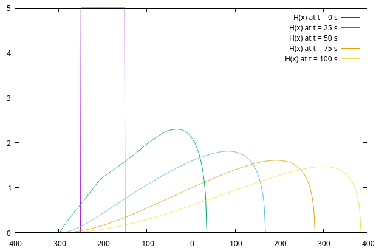
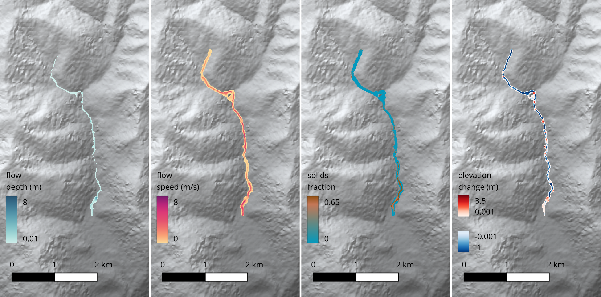

.. _quick_start:

Quick start
===========

.. _dependencies:

Dependencies
------------
Kestrel is written in Fortran 2003, with some additional C++ calls to geospatial libraries.
It should be possible to compile and run it on most modern Unix-like platforms relatively painlessly.
In order to do so, make sure the following dependencies are present on your system:

* Either `GCC <https://www.gnu.org/software/gcc/>`_ version 9+, or an older GCC plus the `Boost <https://www.boost.org/>`_ C++ libraries (>= 1.46.0)
* `GDAL <https://gdal.org/>`_ (>= 2.2.0)
* `PROJ <https://proj.org/>`_
* GNU autotools (if building directly from the git repository)
* (optional) `NetCDF <https://www.unidata.ucar.edu/software/netcdf/>`_ (the
  `NetCDF-Fortran <https://docs.unidata.ucar.edu/netcdf-fortran/current/>`_ 
  library is required in this case)
* (optional) `Julia <https://julialang.org/>`_, for running tests

.. _installation:

Installation
------------

We use GNU autotools for our build system. If building directly from the git repository, you must first generate the relevant build scripts using the command

.. code-block:: bash

  $ autoreconf -fi

Then the code can be compiled with

.. code-block:: bash

  $ ./configure && make

If successful, this places an executable in the src directory. Alternatively,
you may wish to install Kestrel in another location with the commands:

.. code-block:: bash

  $ ./configure --prefix=[installation-directory] && make && make install

It is sometimes necessary to provide additional flags to the configure script,
depending on your local setup. For example, you can do

.. code-block:: bash

  $ ./configure --with-netcdf4=yes/no/PATH

to specify whether to build Kestrel with NetCDF support, where PATH is the
base directory of your (serial) NetCDF installation.  Since NetCDF is useful
(and preferred) we build this support in, if found, unless otherwise specified.

Likewise, if you do not have a newer (>= 9) version of GCC,
you can instead use Boost to do filesystem calls by specifying

.. code-block:: bash

  $ ./configure --with-boost[=ARG]

where ARG optionally specifies the location of your Boost installation.

Both the GDAL and PROJ libraries are required and sometimes might be in unusual
places, depending on your system. If they are not found automatically, their 
base directories can be specified with

.. code-block:: bash

  $ ./configure --with-gdal=[ARG] --with-proj=[ARG]

For testing, the path to a valid Julia executable can be specified with

.. code-block:: bash

  $ ./configure JULIA=[PATH]

This will place a symlink to Julia in the ./tests directory.

Some other options are listed in the help dialogue of the configure script

.. code-block:: bash

  $ ./configure --help

.. _quick_run:

Running simulations
-------------------

Kestrel is run on the command line by specifying a text file containing the
required settings and parameters for the simulations. We have provided a couple
of correctly formatted input files to get you started in the `examples/`
directory.

1D example
^^^^^^^^^^

To begin with, we shall set up a simple simulation of an initial release of
turbulent water, propagating down an inerodible constant slope. 

Input file
""""""""""

Take a look at
the file `examples/Input1d_cap_constslope.txt`. You should see some settings
fields divided into conceptual blocks. Let's go through these in turn.

First is the ``Domain`` block, which sets up the simulation area. 

.. literalinclude:: ../../examples/Input1d_cap_constslope.txt
   :lines: 1-8

The domain is a rectangular region centred at the coordinates specified by
``Lat`` and ``Lon``. It is partitioned into 6 tiles in the :math:`x` direction.
Each of these tiles is further subdivided into ``nXpertile = 200`` finite
volumes.  Since this is a 1D simulation, the corresponding parameters in the
:math:`y` direction are set to 1. The final variable sets the width in metres of
each tile. This implies that the resolution of the numerical discretisation is
``Xtilesize / nXpertile`` = 1 metre.

Next, the ``Cap`` block sets an initial release of flowing material.

.. literalinclude:: ../../examples/Input1d_cap_constslope.txt
   :lines: 10-16

This is a volume of radius 50m, height 5m, initial horizontal velocity 3m/s and
zero solids, centred at :math:`x = -200`\ m.

The ``Topog`` block describes the initial topographic surface over which the flow
propagates.

.. literalinclude:: ../../examples/Input1d_cap_constslope.txt
   :lines: 18-21

In this case, a constant slope with gradient -0.04 (in :math:`x`). ``Topog
params`` is a list that can specify multiple parameters (if required) for more
complicated topographies.

The ``Parameters`` block declares settings that affect the model equations, such
as certain constants, closure functions and other choices.

.. literalinclude:: ../../examples/Input1d_cap_constslope.txt
   :lines: 23-26

Here, we specified that we want to use the commonplace Chézy (or turbulent
fluid) drag law, give the drag coefficient, 0.04, and turn erosion off.

Next are the ``Solver`` settings, which specify further arguments for the
numerical method.

.. literalinclude:: ../../examples/Input1d_cap_constslope.txt
   :lines: 28-30

In particular this includes the length of time to simulate for (100 seconds).
The last line provides the `CFL condition
<https://en.wikipedia.org/wiki/Courant%E2%80%93Friedrichs%E2%80%93Lewy_condition>`_
for the solver, which is used to adaptively limit the time step. This normally
defaults to 0.25, but in 1D, a higher value may be used.

Finally, the ``Output`` block requests 4 simulation outputs. These will be
separated by equal time intervals of :math:`\Delta T = 100 / 4` seconds and
placed in the specified directory.

.. literalinclude:: ../../examples/Input1d_cap_constslope.txt
   :lines: 32-34

We can run the simulation from within the `examples/` directory using the
command

.. code-block:: bash

   $ ../src/kestrel Input1d_cap_constslope.txt

You can find the output in `examples/1d_cap_constslope/`.

Viewing .txt output
"""""""""""""""""""

After changing to the output directory, you should see the following text files:

    * Numbered solution files of the form `000000.txt`, `000001.txt`, ...
      containing the simulated fields at the indicated output step. The first of
      these is the initial condition
    * Numbered topography files of the form `000000.txt_topo`,
      `000001.txt_topo`, ... containing topographic data at the indicated output
      step.
    * A file `Maximums.txt` containing the maximum values attained at each spatial
      point, over the simulated time period, for the height, speed and so forth.
      This file also records the time of inundation for each point
      in the domain.
    * `Volume.txt`, which records the total volume and mass of material in the
      flow and in the bed, and the portion of these quantities occupied by
      solids (sediment particles) at each output step.

Each of these files consists of comma-separated numeric columns, with a header
line that briefly describes the content of each entry. This allows quick and
easy plotting in your program of choice. For example, to view the solution depth
at each output step, :math:`t = 100\mathrm{s}`, (as a function of :math:`x`) you
can instruct `gnuplot <http://www.gnuplot.info/>`_ to plot lines according to
2nd and 3rd fields of each file of the form `00000*.txt`::

   gnuplot> plot for [i=0:4] sprintf("00000%d.txt", i) u 2:3 w l title sprintf("H(x) at t = %d s", i * 25)

Depending slightly on your local setup, this should produce a figure like:

showing the collapse of the initial water column into a front that propagates
down the slope in the positive :math:`x` direction.

An additional file, `RunInfo.txt`, contains various details of the simulation,
including all the settings needed to restart it. You can use it as a reference
when viewing simulation data.

For further details on the data produced by Kestrel, consult the :ref:`output` page.

2D example
^^^^^^^^^^

Kestrel has the capability to simulate much more complex flows than the example
above. Let's set up a run that's closer to the kinds of simulations that are
useful for modelling real-world scenarios.

Input file
""""""""""

The file `examples/Input2d_flux_SRTM.txt` specifies the settings for a 2D
simulation to run on an SRTM topographic map. It is quite liberally commented
and can be used as a quick reference for the most common input options:

.. literalinclude:: ../../examples/Input2d_flux_SRTM.txt
   :language: bash

.. note::

    Input files allow other settings and parameters to be set than those shown
    in the above example. For unspecified settings, default values are
    used. See :ref:`settings_and_parameters` for more details.

This input file contains a few notable differences to the previous example.

Firstly, in place of the ``Cap`` block, which provided an initial volume
release, there is a ``Source``. 

.. literalinclude:: ../../examples/Input2d_flux_SRTM.txt
   :lines: 23-29

This specifies source fluxes as input material for the flow, occurring within
a circle centred at ``SourceLat``/``SourceLon`` with a 5 metre radius. These
fluxes are time dependent, in accordance with the given time series data. In
general, any number of ``Cap`` and ``Source`` blocks may be specified for a
simulation.

A few other important lines to note are:

    * ``format = nc`` in the ``Output`` block, which specifies output via
      NetCDF data files (with `.nc` extension). To use this, Kestrel must be
      built with NetCDF support enabled. This data format is more compact and
      often more convenient than `.txt` files for 2D simulations.
    * The ``Topog`` block is set up to use SRTM data to obtain a representation
      of the topography.  This data can be obtained separately, from `NASA Earth
      Data <https://www.earthdata.nasa.gov/>`_ or the `USGS Earth Explorer
      <https://earthexplorer.usgs.gov/>`_ and it comes in a standard format,
      divided into patches that cover the Earth's surface.
      Kestrel will automatically look for the relevant file(s) in the `./SRTM/`
      directory, as specified. In this case, it needs to find either the zipped
      SRTM file `./SRTM/S12W077.SRTMGL1.hgt.zip` or an unzipped file
      `./SRTM/S12/S12W077` with either `.hgt` or `.tif` extension (unzipped
      filenames are case insensitive). A suitable `.tif` file is provided in the
      repository, so the example should work out of the box.
    * ``Erosion = Fluid`` turns erosion on (and specifies a particular closure
      law), so this is a morphodynamic simulation. This motivates the
      inclusion of many of the other options in the ``Parameters`` block. The
      implications of these are detailed in :ref:`settings_and_parameters`.

As before, we run the simulation on the command line, passing the input file as
a command line argument. 

.. code-block:: bash

  $ ../src/kestrel Input2d_flux_SRTM.txt

.. warning::
   Don't forget to compile with NetCDF, or this example won't run.

.. note::
   This example takes some time to run and requires about 2Gb of free RAM. You
   may wish to decrease ``T end`` to simulate a shorter period of time.

.. _quick_view:

Viewing NetCDF output
"""""""""""""""""""""

After running the simulation and moving to the output directory
`./2d_flux_SRTM`, you will see the NetCDF solution files `000000.nc`,
`000001.nc`, ..., as well as the file `Maximums.nc` containing the maximum
values of observable fields over the simulation period.

There are many ways to view NetCDF data. The most convenient is probably to open
them directly in a GIS program that supports this format. The solution files are
georeferenced so that they automatically appear at the correct coordinates.

For `QGIS <https://www.qgis.org>`_, the experimental 
`Lahar Flow Map Tools
<https://plugins.qgis.org/plugins/laharflow_maptools/>`_ plugin can be used,
which automates some of the work needed to get the data into a presentable
format. This may be installed within QGIS itself and requires the
`python3-netcdf4 <https://pypi.org/project/netCDF4/>`_ library to run properly
(which must be installed separately on your local machine).

An example of the output produced by Kestrel by the Input2d_flux_SRTM.txt input
file, made in QGIS (using *Lahar Flow Map Tools*) is shown below. (The hill
shaded background map is obtained by loading the SRTM topography file
separately.)

Testing
-------

If you want to check that Kestrel is working well, there is a lightweight test
suite available as a Julia script. It is unlikely to be necessary to run these
if you are only using the main code branch to run simulations. However, when
modifying the code, these tests can be used to identify problems. 

To run all tests, change to the ./tests subdirectory and run:

.. code-block:: bash

   $ ./julia runall.jl

Note that this assumes the existence of a valid Julia symlink within ./tests.

Most of the tests run simple simulations and perform consistency checks like
verifying conservation of flow volume. They are divided into different
categories that can be specified on the command line. For example to execute
just the 'noflow' tests, which check that initially static flows with horizontal
free surfaces remain at rest, you can run:

.. code-block:: bash

   $ ./julia runall.jl noflow

Any number of test categories may be specified in this way.

The command

.. code-block:: bash

   $ ./julia runall.jl help

prints a list of the available categories.

.. warning::

   Running these is the first step in debugging and won't catch everything.
   At this stage, you will most likely need to read runall.jl and testlib.jl
   carefully to understand what each test is doing.
